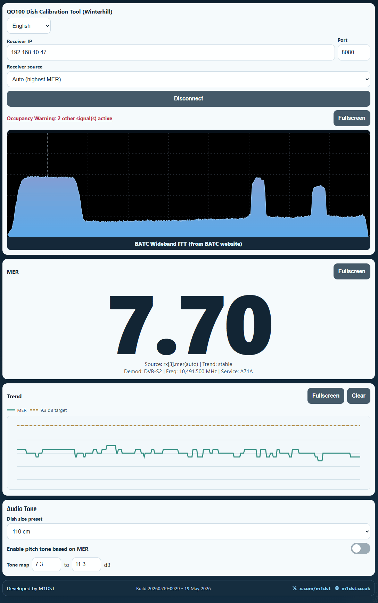

# QO100 Align Tool

Web-based dish alignment UI for Winterhill/Longmynd style MER monitoring.



## Features

- Connect to local WebSocket receiver (`ws://<ip>:<port>`)
- Large real-time MER display
- MER trend chart with target line
- Optional pitch tone based on MER
- BATC wideband FFT view + occupancy warning
- Mobile-friendly layout with fullscreen panel modes
- Multi-language UI

## Project Structure

- `src/index.html` app markup
- `src/styles.css` app styles
- `src/app.js` app logic
- `build.mjs` production minify build
- `dist/` generated production output (created by build)

## Requirements

- Node.js 18+ (recommended)
- npm

## Install

```bash
npm install
```

## Development

Serve unminified source from `src/`:

```bash
npm run dev
```

Default dev URL:

- `http://localhost:5173`

## Production Build (Minified)

Build minified HTML/CSS/JS into `dist/`:

```bash
npm run build
```

Serve built files:

```bash
npm run start
```

Default production URL:

- `http://localhost:4173`

## Raspberry Pi Install (HTTP port 80)

See the beginner guide:

- `docs/raspberry-pi-install.md`

This installer does not build on the Pi. It downloads a prebuilt `dist` artifact from GitHub Releases.

Quick command pattern:

```bash
curl -fsSL https://raw.githubusercontent.com/m1dst/qo100-align/master/scripts/install-pi.sh | bash
```

Stop Nginx quickly:

```bash
curl -fsSL https://raw.githubusercontent.com/m1dst/qo100-align/master/scripts/stop-nginx.sh | bash
```

Uninstall deployment:

```bash
curl -fsSL https://raw.githubusercontent.com/m1dst/qo100-align/master/scripts/uninstall-pi.sh | bash
```

This intentionally serves over HTTP (not HTTPS) to avoid mixed-content blocking with `ws://` receiver connections.

## CI Release Artifact

GitHub Actions workflow `.github/workflows/release-dist.yml` builds `dist/` on pushes to `master` and publishes release assets:

- `qo100-align-dist.tar.gz`
- `qo100-align-dist.sha256`

## Clean Build Output

```bash
npm run clean
```

## Receiver Connection

Set receiver IP and port in the UI, then connect.

Typical default:

- IP: `192.168.10.47`
- Port: `8080`

The app stores last successful IP/port and restores it on next load.

## Debug Mode

Add `?debug=1` to URL to show payload debug panel:

- `http://localhost:5173/?debug=1`
